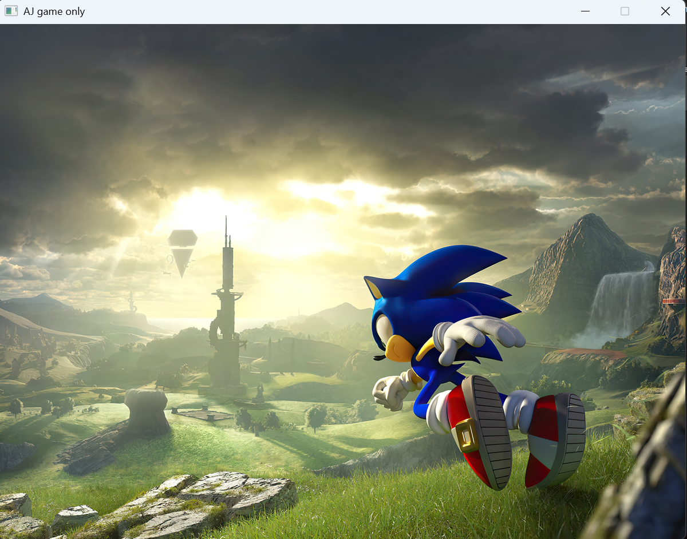
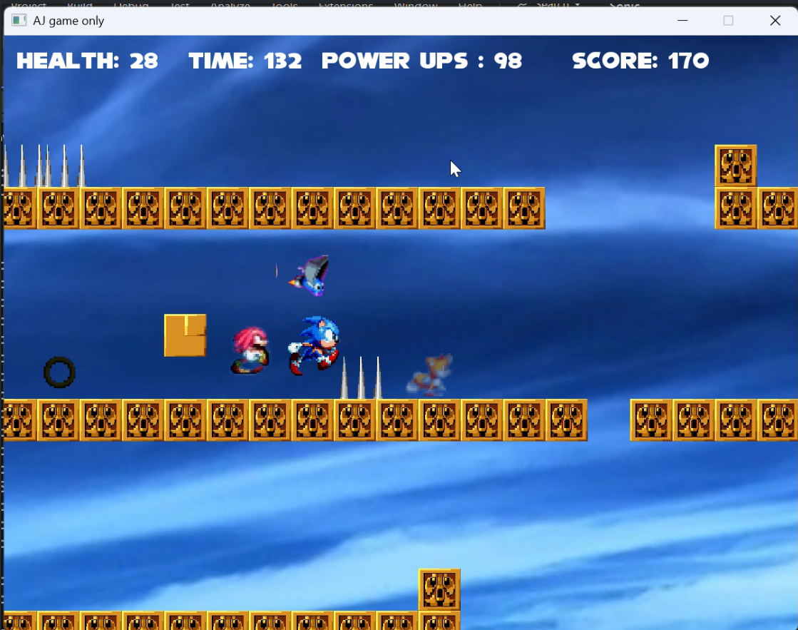
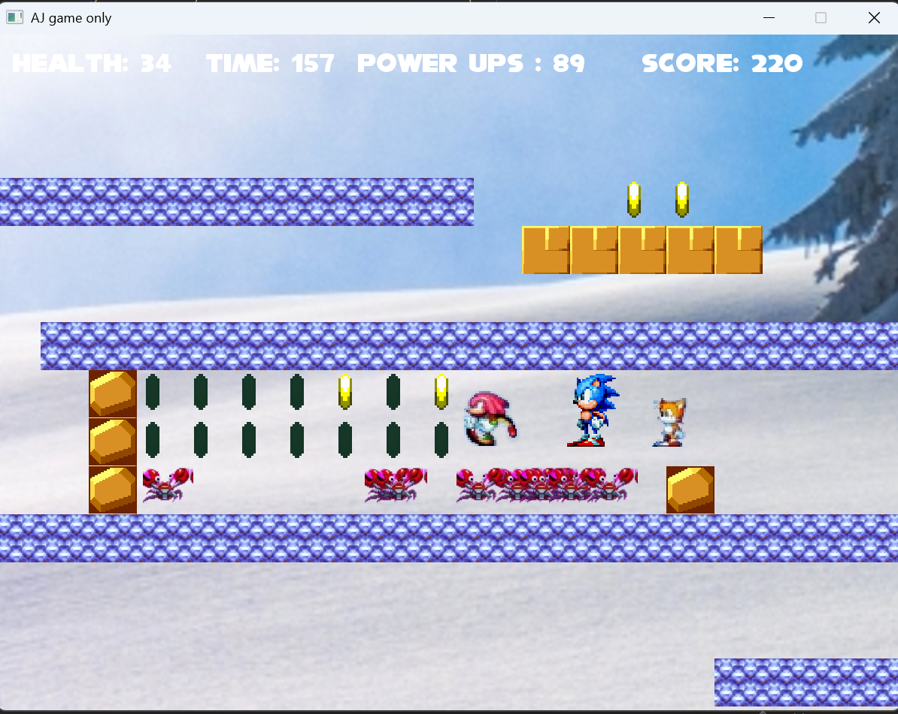
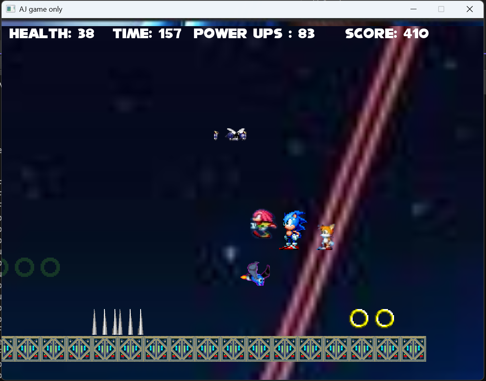
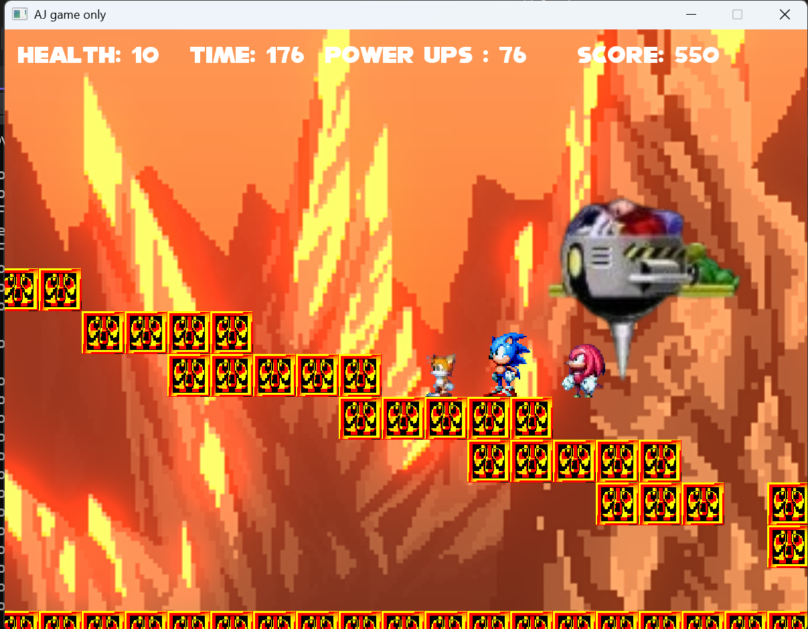
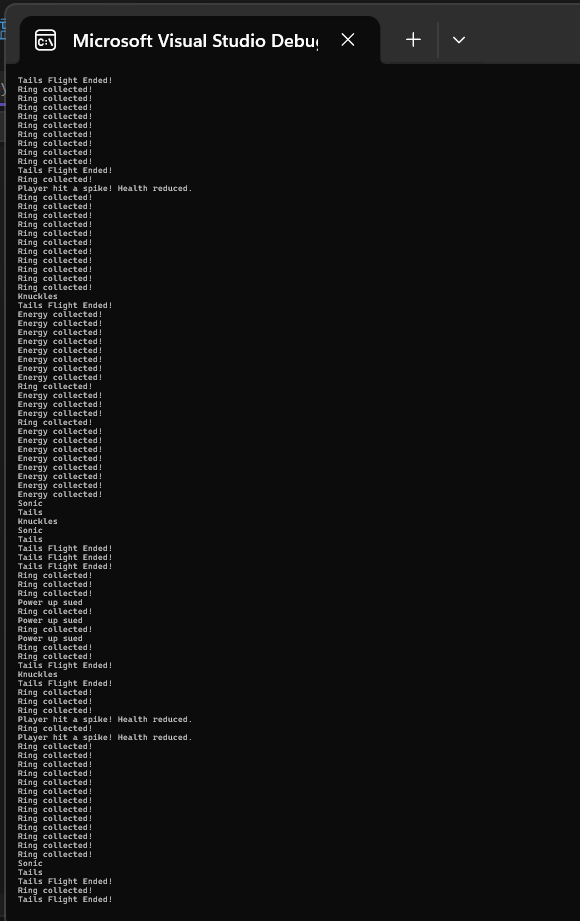

# 🦔 Sonic Platformer — C++ SFML Game

A  2D Sonic the Hedgehog platformer built in **C++ using SFML**.  
Developed as an Object-Oriented Programming course project featuring multiple levels, enemy AI, boss fights, collectibles, and a full audio system.

> ⚠️ **Note:** Some large asset files were excluded from this repo due to GitHub's size limitations. All core source files and required assets are included.

---

## 📸 Screenshots

### Main Menu


### Level 1 — Sky Zone


### Level 2 — Snow Zone


### Level 3 — Dark Zone


### Boss Level — Fire Zone


### Level Transition Screen


### Debug Console Output


---

## 🎮 Features

- **4 Levels** — Snow, Sky, Dark, and Fire/Boss zones
- **3 Playable Characters** — each with unique abilities:
  - 🔵 **Sonic** — fast movement and spin dash
  - 🦊 **Tails** — can fly using twin tails
  - 👊 **Knuckles** — can break walls
- **Enemy AI** — multiple enemy types that move and attack
- **Boss Fight** — Dr. Eggman boss battle in the final level
- **Ring Collection System**
  - 🟢 Green rings → restore health
  - ⚫ Black rings → activate power up
  - **P counter** → tracks power up count
- **HUD** — real-time Health, Score, Timer, and Power Up display
- **Level Transitions** — animated screen between levels
- **Sound Effects & Background Music** — per level audio
- **Collision System** — full platformer physics with spikes, walls, and floors
- **Leaderboard & Save System**

---

## 🕹️ Controls

| Key | Action |
|-----|--------|
| ⬅️ ➡️ Arrow Keys | Move left / right |
| ⬆️ Arrow Key | Jump |
| ⬇️ Arrow Key | Crouch |
| **Z** | Switch character |
| **X** | Use character's special ability |
| **Escape** | Pause / Quit |
| **Enter** | Confirm in menus |
| **Y / N** | Yes / No prompts |

---

## 🛠️ Requirements

- Windows OS
- Visual Studio (2019 or later recommended)
- [SFML 2.x](https://www.sfml-dev.org/) library configured in Visual Studio

---

## 🚀 How to Run

1. Install **SFML** and link it in Visual Studio  
   → [SFML Setup Guide for Visual Studio](https://www.sfml-dev.org/tutorials/2.6/start-vc.php)
2. Clone this repository:
   ```
   git clone https://github.com/aj-resp/sonic-platformer-sfml.git
   ```
3. Open `Sonic.vcxproj` in Visual Studio
4. Build the project (**Ctrl + Shift + B**)
5. Run the game (**F5**)

> ⚠️ Make sure the `Data/` folder stays in the **same directory** as the executable so all textures, sounds, and level maps load correctly.

---

## 📁 Project Structure

```
sonic-platformer-sfml/
│
├── Data/                   # Game assets (sprites, audio, level maps, backgrounds)
├── images/                 # Screenshots for README
│
├── Source.cpp              # Main game loop and level management
├── Character.h             # Base character class
├── player.h                # Player movement, physics, and input
├── enemi.h                 # Enemy AI and behavior
├── SoundManager.h          # Audio system
│
├── Sonic.vcxproj           # Visual Studio project file
├── Sonic.vcxproj.filters   # VS filters
│
├── README.md
├── LICENSE
└── .gitignore
```

---

## 👨‍💻 Authors

| Student ID |
|------------|
| 24i-0569   |
| 24i-0720   |

Developed as part of an **Object-Oriented Programming (OOP)** course project.

---

## 📄 License

This project is for educational purposes only.  
Sonic the Hedgehog and related characters are trademarks of **SEGA**.  
All game assets belong to their respective owners.
